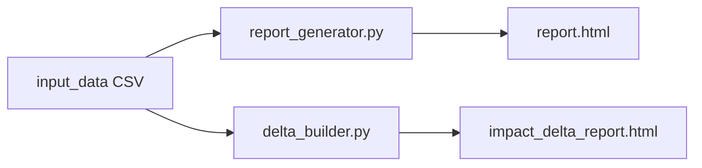

# Architecture

## Overview

This repository contains two standalone Python report builders that read cart-level sales CSVs and emit self-contained HTML files (charts via CDN).

## Sales report (`report_generator.py`)

- **Input:** cart line items (one row per product per order).
- **Output:** `reports/report.html`
- **Config:** CLI flags (`--input`, `--output`, `--store`); auto-detects newest CSV in `reports/input_data/`.
- **Scope:** descriptive and actionable analytics—timeline, products, basket rules, optional profitability when `margin_pct` is present.

## Delta report (`delta_builder/delta_builder.py`)

- **Input:** same CSV schema; path set in `delta_report_config.json`.
- **Output:** `reports/delta_builder/impact_delta_report.html` plus optional JSON/CSV artifacts.
- **Config:** `delta_report_config.json` (event window, product groups, store metadata).
- **Scope:** pre/post comparison around a selected event date (revenue, units, ticket, mix).

## Shared conventions

- Python 3.10+, pandas, numpy (`requirements.txt` at repo root).
- Paths resolve relative to each script’s project folder (`reports/`), so commands can be run from the repository root.
- Generated HTML and local CSV exports are gitignored; only `sales_carts_sample.csv` is committed for demos.
